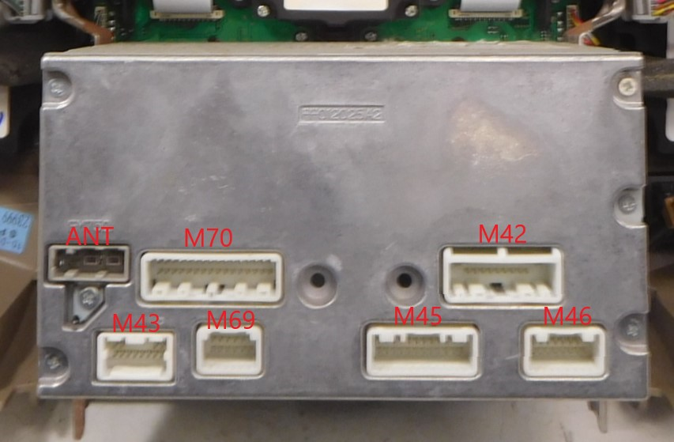

# Nissan Pathfinder R51 Head Unit Adapter
This repo contains documentation and code to turn an Arduino into a CAN Bus
climate control adapter for the Nissan Pathfinder R51 (2005 - 2012). This is
compatible with Pathfinders that came stock with the screen based infotainment
systems. This adapter allows the replacement of the infotainment system and
will not work with the infotainment system installed.

This system may be compatible with with other Nissan models (Armada, QX56, etc)
of the same years.

## Arduino Hardware
The software targets the Arduino Lenoardo compatible [CAN Bed v1] but should
work with any MCP2515 implementation with some small updates.

## Software Interface
The software exposes a serial protocal compatible with [RealDash].

_Serial protocol TBD._

## Vehicle Implementation 

These sections are meant to give details on the R51's climate control
implementation. You do not need to know any of this information in order to use
the module.

## R51 Systems

The R51 contains two CAN connected ECUs critical to the operation of the
climate control system: the A/C Auto Amp the AV Control Unit.

The A/C Auto Amp is the computer which is connected to the climate control
hardware. It contains the relays and motor drivers and is connected to the rear
A/C controls. The A/C Auto Amp is connected to the various climate control
sensors and to the BCM to forward signals to the ECM which control activation
of the A/C compressor.

The AV Control Unit is the car's infotainment system. It consists of the AV
Control Unit itself, the Display Unit (LCD screen), and the A/C and AV Switch
Assembly. The AV Control Unit sends signals over CAN to control the state of
the climate control system.

### CAN Protocal

The A/C Auto Amp maintains the current state of the climate control system. It
sends CAN frames with the current state so that connected systems can display
that state to the user.

The AV Control Unit listens for CAN frame from the A/C Auto Amp and displays
the current state to the user. It also manages the state of most of the LEDs on
the A/C switches.

#### CAN Frame Definitions

The following CAN frames are exchanged by the climate control sytem.

| ID    | Purpose                                                                                  | Sender          | Listener        |
| ----- | ---------------------------------------------------------------------------------------- | --------------- | --------------- |
| 0x35D | External communication. Used to signal compressor state and control rear defrost heater. | AV Control Unit | BCM, ECU        |
| 0x540 | Button state. Requests changes to unit power, compressor, temperature, and mode.         | AV Control Unit | A/C Auto Amp    |
| 0x541 | Button state. Requests changes to fan speed and recirculation.                           | AV Control Unit | A/C Auto Amp    |
| 0x54A | Climate state. Sends current temperature configuration.                                  | A/C Auto Amp    | AV Control Unit |
| 0x54B | Climate state. Sends current power state, mode, fan speed, and recirculation.            | A/C Auto Amp    | AV Control Unit |
| 0x625 | Climate state. Sends current state of the rear defrost.                                  | Unknown         | Unknown         |

##### CAN Frame ID 35D
I have not fully decoded this this CAN frame but it appears to be sent form the
AV Control Unit or A/C Auto Amp to control the A/C compressor and rear defrost.

The eight bit controls the A/C compressor. 0 is off, 1 is on.

The 6th and 7th bits control the rear defrost. 00 is off, 11 is on.

Possible values:
* `00000000` defrost off, compressor off
* `00000001` defrost off, compressor on
* `00000110` defrost on, compressor off
* `00000111` defrost on, compressor on

The other bytes of the payload are repeated back. This requires the most
recently received frame to be stored in order to manipulate compressor and rear
defrost state.  

##### CAN Frame ID 540
This frame is sent by the AV Control Unit to initialize the A/C Auto Amp,
enable auto mode (this also turns on the unit), turn off the unit,
enable/disable the compressor, change the airflow direction (the "mode"), and
enable/disable dual zone control.

```
    +---------------------- 80 during init, 00 to ack, 60 when running
    |
    |  +------------------- 00 during init, 40 when running
    |  |
    |  |     +------------- driver temperature control
    |  |     |
    |  |     |  +---------- passenger temperature control
    |  |     |  |
    |  |     |  |  +------- temperature control and A/C compressor
    |  |     |  |  |
    |  |     |  |  |  +---- mode, front defrost, and dual zone
    |  |     |  |  |  |
540#60:40:00:00:00:00:04:00
    1  2  3  4  5  6  7  8
```

_Byte 1 and 2: Unit Status_

These bytes are changed in order to indicate the status of the unit: either
initializing, acknowledging first packages from the A/C Auto Amp, or normal
operation. Handshake is covered in a later section. Under normal operations
these bytes are 0x60 and 0x40.

_Byte 4: Driver Temperature Control_

This is an 8-bit unsigned integer indicating the temperature of the driver side
climate zone. It has an allowed value range from 0xF4 to 0x13. The value
increments or decrements by 1 when the driver side temperate knob is turned.
The value wraps around: Incrementing when the value is 0xFF moves to 0x00 as
one would expect of an unsigned integer.

These correspond to the temperature of the zone in Fahrenheit where 0xF4 is 60
degrees and 0x13 is 90.

It is likely possible to send a specific temperature. This is untested.

_Byte 5: Passenger Temperate Control_

This is a single byte indicating the temperate of the passenger side. It works
the same as the driver side value except the range is different. The range is
0x09 to 0x27.

_Byte 6: Temperature Control and A/C Compressor_

Possible values:
* `00000000` temperature change; compressor off
* `00100000` temperature change; compressor off
* `00001000` temperature change; compressor on
* `00101000` temperature change; compressor on

Bit meanings (left to right):
* Bit 1: Always 0.
* Bit 2: Always 0.
* Bit 3: Flipped any time a temperature change occurs.
* Bit 4: Always 0.
* Bit 5: Indicates to the A/C Auto Amp whether or not to enable the A/C compressor. 1 is on, 0 is off as one might expect.
* Bit 6: Always 0.
* Bit 7: Always 0.
* Bit 8: Always 0.

_Byte 7: Mode, Front Defrost, and Dual Zone Control_

Examples:
* `00100100` auto mode toggled
* `00001100` dual zone climate control toggled
* `00000110` front defrost toggled
* `00000101` air flow mode toggled

Bit meanings (left to right):
* Bit 1: Flipped to toggle the unit off.
* Bit 2: Always 0.
* Bit 3: Flipped to enable the "auto" mode of the climate control unit.
* Bit 4: Always 0.
* Bit 5: Flipped to toggle dual zone climate control.
* Bit 6: Always 1.
* Bit 7: Flipped to toggle front defrost.
* Bit 8: Flipped to toggle the "mode" - the direction of the airflow.

##### CAN Frame ID 541
This frame is sent by the AV Control Unit to change fan speed and toggle
recirculation. 

```
    +---------------------- change fan speed
    |
    |  +------------------- toggle recirculation
    |  |
541#00:00:00:00:00:00:00:00
    1  2  3  4  5  6  7  8
```

_Byte 1: Change Fan Speed_

Bit meanings (left to right):
* Bit 1: Always 0.
* Bit 2: Always 0.
* Bit 3: Flipped to increase fan speed.
* Bit 4: Flipped to decrease fan speed.
* Bit 5: Always 0.
* Bit 6: Always 0.
* Bit 7: Always 0.
* Bit 8: Always 0.

_Byte 2: Toggle Recirculation_

Bit meanings (left to right):
* Bit 1: Always 0.
* Bit 2: Flip to toggle recirculation.
* Bit 3: Always 0.
* Bit 4: Always 0.
* Bit 5: Always 0.
* Bit 6: Always 0.
* Bit 7: Always 0.
* Bit 8: Always 0.

##### CAN Frame ID 54A
This frame is sent by the A/C Auto Amp to indicate the zone temperatures.

```
                +---------- current driver temperature
                |
                |  +------- current passenger temperature
                |  |
54A#3C:3E:7F:80:00:00:00:45
    1  2  3  4  5  6  7  8
```

_Byte 5: Driver Temperature_

This is an 8-bit unsigned integer representing the temperate of the driver side
climate zone in Fahrenheit. Values are from 60 to 90.

_Byte 6: Passenger Temperature_

This is an 8-bit unsigned integer representing the temperate of the passenger
side climate zone in Fahrenheit. Values are from 60 to 90.

##### Frame ID 54B
This frame is sent by the A/C Auto Amp to indicate unit status, mode, front
defrost, fan speed, recirculation, and dual climate zone mode.

```
    +---------------------- A/C compressor, auto mode, power off
    |
    |  +------------------- mode, defrost
    |  |
    |  |  +---------------- fan speed
    |  |  |
    |  |  |  +------------- recirculation, dual zone control
    |  |  |  |
54B#59:84:08:12:00:00:00:02
    1  2  3  4  5  6  7  8
```

_Byte 1: A/C Compressor, Auto Mode, Power Off_

Possible values:
* `0x41 (01000001)` A/C compressor Off, Auto Mode On
* `0x42 (01000010)` A/C compressor Off, Auto Mode Off
* `0x59 (01011001)` A/C compressor On, Auto Mode On
* `0x5A (01011010)` A/C compressor On, Auto Mode Off
* `0x72 (01110010)` system not operational
* `0xF2 (11110010)` power Off

Bit meanings (left to right):
* Bit 1: Unit operational state. Unit is not operational when 0 and unit is off.
* Bit 2: Always 1.
* Bit 3: Unit power. Set to 1 when power is off.
* Bit 4: Unknown. Set to 1 when A/C is on or when unit is off.
* Bit 5: A/C power. Set to 1 when A/C is enabled.
* Bit 6: Always 0.
* Bit 7: Unknown. Set to 1 when auto is off or power is off.
* Bit 8: Auto setting. Set to 1 when auto is on.

_Byte 2: Mode, Defrost_

Possible values:
* `0x00 (00000000)` Power Off
* `0x04 (00000100)` Face
* `0x08 (00001000)` Face and Feet
* `0x0C (00001100)` Feet
* `0x10 (00010000)` Feet and Windshield
* `0x34 (00110100)` Windshield
* `0x84 (10000100)` Auto; Cooling; Face
* `0x88 (10001000)` Auto; Neutral; Face and Feet
* `0x8C (10001100)` Auto; Heating; Feet

Windshield (defrost) is not possible in auto mode. Change the mode or enabling
defrost takes the unit out of auto mode. 

_Byte 3: Fan Speed_

This is an unsigned integer between 0x00 and 0x0F representing eight fan
speeds. The value increments and decrements by 0x02. The unit may sometimes
indicate half speeds. It is assumed that the value is rounded up in these
cases.

Fan speed it reported as 0x00 when the unit is off.

_Byte 4: Recirculation and Dual Zone Control_

Possible values:
* `0x12 (00010010)` recirculation on, dual off
* `0x24 (00100100)` recirculation off, dual off
* `0xD2 (11010010)` recirculation on, dual on
* `0xE2 (11100010)` recirculation off, dual on

Bit meanings (left to right):
* Bit 1: Dual zone control. 0 is off, 1 is on.
* Bit 2: Dual zone control. 0 is off, 1 is on.
* Bit 3: Recirculation. 0 is on, 1 is off.
* Bit 4: Recirculation. 1 is on, 0 is off.
* Bit 5: Always 0.
* Bit 6: Unknown.
* Bit 7: Unknown.
* Bit 8: Always 0.

##### Frame ID 625
This frame is sent when the A/C compressor or rear defrost is toggled. The
sender and listeners are unknown at this point though it is assumed that it is
sent to indicate the current status of these items and not to change their
state.

```
    +---------------------- A/C compressor, rear defrost heater
    |
625#C0:03:00:00:00:00:00:00
    1  2  3  4  5  6  7  8
```

_Byte 1: A/C Compressor and Rear Defrost Heater_

* Bits 1-2: Always 1.
* Bits 3-5: Always 0.
* Bits 6-7: Indicates rear defrost heater status. 00 is off, 11 is on.
* Bit 8: Indicates A/C compressor status. 1 is on, 0 is off.

#### Initialization

The climate control systems boot when the ignition is turned on. At boot time
they both are in an "initialization" state. A handshake between the A/C Auto
Amp and AV Control Unit must occur before the climate control systems become
active.


During initalization the AV Control Unit repeats frames `540` and `541` at an
interval which varying between 100ms and 400ms. They each have the same payload:
```
540#8000000000000000
541#8000000000000000
```

When the A/C Auto Amp receives the above initialization packets it restores the
climate control to the last saved state. It sends frames `54B` and `54A` (in
that order) to indicate the running state:
```
54B#F200002400000000
54A#3C3E7F800000002C
```

The AV Control Unit reponds with updated `540` and `541` frames to acknowledge:
```
540#0000000000000000
541#0000000000000000
```

From this point forward the system is initialized and begins normal operations.

#### Normal Operation

Under normal operation the A/C Auto Amp and AV Control Unit send frames at a
regular interval to indicate their current state. A state change in a unit
causes them to send updated frames immediately.

The A/C Auto Amp responds to `540` and `541` frames from the AV Control Unit.


The `540` and `541` frames appear to repeat at an interval which varies between
100ms and 1200ms.

### Head Unit Pinout

The R51 AV Control Unit (head unit) has 7 connectors. They're labeled in the
service manual as M42, M43, M44, M45, M46, M69, and M70. Pins on the connectors
are labeled 1 through 119. I've attempted to document their relevant
functionality here.



The following housings or harness parts are assumed to be compatible. This is
pending confirmation.

| Connector | Pin | Housing      | Harness or Alternate Part                 | 
| --------- | --- | ------------ | ----------------------------------------- |
| M42       |  20 |              | Metra 70-7552, ["Upgraded" Metra 70-7552] |
| M43       |  12 |              |                                           |
| M44       |   3 |              | Metra 40-NI12                             |
| M45       |  24 | TE 1376103-1 |                                           |
| M46       |  16 | TE 1376106-1 |                                           |
| M69       |  12 | TE 1379675-5 | Metra 70-7554, TE 1379675-1               |
| M70       |  32 | TE 1473799-1 |                                           |

#### Connector M42

Contains wires for the speakers, accessor power, dash illumination, and
steering switch. The speaker terminals are not connected for R51s equiped with
the Bose amplifier.

| Pin | Color | Signal Name | Purpose                            |
| --- | ----- | ----------- | ---------------------------------- |
|   1 |       |             | not connected                      |
|   2 | BR    | FR_SP_LH+   | front left speaker (+)             |
|   3 | L     | FR_SP_LH-   | front left speaker (-)             |
|   4 | G     | RR_SP_LH+   | rear left speaker (+)              |
|   5 | B     | RR_SP_LH-   | rear left speaker (-)              |
|   6 | Y     | STRG_SW_A   | steering wheel switch up           |
|   7 | G/Y   | ACC         | accessory power, 10A fuse          |
|   8 |       |             | not connected                      |
|   9 | V     | ILL+        | dash illumination, battery voltage |
|  10 |       |             | not connected                      |
|  11 | LG    | FR_SP_RH+   | front right speaker (+)            |
|  12 | R     | FR_SP_RH-   | front right speaker (-)            |
|  13 | GR    | RR_SP_RH+   | rear right speaker (+)             |
|  14 | O     | RR_SP_RH-   | rear right speaker (-)             |
|  15 |       | STRG_SW_GND | steering wheel switch ground       |
|  16 | BR    | STRG_SW_B   | steering wheel switch down         |
|  17 |       |             | not connected                      |
|  18 |       |             | not connected                      |
|  19 | Y     | +B          | battery power, 20A fuse            |
|  20 | B     | GND         | ground                             |

The steering wheel pins connect to the spiral cable with a ground line.

Steering switch function approximate resistance:

| Function      | Line      | Resistance |
| ------------- | --------- | ---------- |
| Volume (up)   | STRG_SW_A |        487 |
| Seek (up)     | STRG_SW_A |        165 |
| Power         | STRG_SW_A |          0 |
| Volume (down) | STRG_SW_B |        487 |
| Seek (down)   | STRG_SW_B |        165 |
| Mode          | STRG_SW_B |          0 |

#### Connector M43

Connected to satellite radio tuner if present.

| Pin | Color | Signal Name  | Purpose         |
| --- | ----- | ------------ | --------------- |
|  21 | G     | N_BUs_LH-    |                 |
|  22 | R     | N_BUS_LH+    |                 |
|  23 | W     | N_BUS_RH-    |                 |
|  24 | B     | N_BUS_RH+    |                 |
|  25 |       | N_BUS_SH     | shield          |
|  26 |       | DATA_GND     |                 |
|  27 |       |              | not connected   |
|  28 | O     | REQ_(TO HU)  | satellite tuner |
|  29 | P     | RX_(TO HU)   | satellite tuner |
|  30 | L     | TX_(FROM HU) | satellite tuner |
|  31 |       |              | not connected   |
|  32 |       |              | not connected   |

#### Connector M44

This is the antenna connector.

| Pin | Color | Signal Name  | Purpose         |
| --- | ----- | ------------ | --------------- |
|  33 | B     |              | powered antenna |
|  34 | B     | ANT AMP      | antenna signal  |
|  35 | B     | ANT AMP      | antenna signal  |

#### Connector M45

This connector is for video output.

| Pin | Color | Signal Name  | Purpose       |
| --- | ----- | ------------ | ------------- |
|  36 | G     | COMP_OUT+    |               |
|  37 | R     | COMP_OUT-    |               |
|  38 | R     | B            |               |
|  39 | B     | G            |               |
|  40 | W     | R            |               |
|  41 | R     | RGB_SYNC     |               |
|  42 |       | RGB_SYNC_GND |               |
|  43 | G     | YS           |               |
|  44 | LG    | DISP_IT      |               |
|  45 | B     | HP           |               |
|  46 | BR    | SIG_GND      |               |
|  47 | R     | SIG_VCC      |               |
|  48 |       |              | not connected |
|  49 |       | COMP_SHIELD  |               |
|  50 |       | RGB_GND      |               |
|  51 |       |              | not connected |
|  52 |       |              | not connected |
|  53 |       |              | not connected |
|  54 | B     | GND          |               |
|  55 |       | SHIELD       |               |
|  56 | V     | IT_DISP      |               |
|  57 | W     | VP           |               |
|  58 | SB    | INV_GND      |               |
|  59 | O     | INV_VCC      |               |
 
#### Connector M46

This connector is for video input.

| Pin | Color | Signal Name    | Purpose                 |
| --- | ----- | -------------- | ----------------------- |
|  60 |       |                | not connected           |
|  61 |       |                | not connected           |
|  62 |       |                | not connected           |
|  63 |       |                | not connected           |
|  64 | W     | VTR+           | DVD player              |
|  65 | B     | VTR-           | DVD player              |
|  66 | G     | COMP_IN+       |                         |
|  67 |       |                | not connected           |
|  68 | BR    | RV_CAM_SIG     | backup camera signal    |
|  69 |       |                | not connected           |
|  70 |       |                | not connected           |
|  71 |       |                | not connected           |
|  72 |       | COMP_IN_SHIELD |                         |
|  73 |       | GND            | shield                  |
|  74 | R     | COMP_IN-       |                         |
|  75 |       |                | not connected           |

#### Connector M69

This connects to the amplifier. It contains the pre-outs and amplifier on line.

| Pin | Color | Signal Name    | Purpose                       |
| --- | ----- | -------------- | ----------------------------- |
| 108 | R     | RR_RH_PRE+     | rear right pre-out (+)        |
| 109 | G     | FR_RH_PRE+     | front right pre-out (+)       |
| 110 | B     | AMP_ON         | amplifier on, battery voltage |
| 111 |       |                | shield                        |
| 112 | L     | RR_LH_PRE+     | rear left pre-out (+)         |
| 113 | R     | FR_LH_PRE+     | front left pre-out (+)        |
| 114 | B     | RR_RH_PRE-     | rear right pre-out (-)        |
| 115 | W     | FR_RH_PRE-     | front right pre-out (-)       |
| 116 |       |                | not connected                 |
| 117 |       |                | not connected                 |
| 118 | Y     | RR_LH_PRE-     | rear left pre-out (-)         |
| 119 | B     | FR_LH_PRE-     | front left pre-out (-)        |

#### Connector M70

This connects to the various CAN busses, aux input, and reverse/park/speed
inputs.

| Pin | Color | Signal Name       | Purpose                      |
| --- | ----- | ----------------- | ---------------------------- |
|  76 | R     |  HP_RH-           |                              |
|  77 | B     |  HP_RH+           |                              |
|  78 |       |                   | not connected                |
|  79 |       |                   | not connected                |
|  80 |       |                   | not connected                |
|  81 |       |                   | not connected                |
|  82 | G     |  AUDIO_BUS_RH-    |                              |
|  83 | R     |  AUDIO_BUS_RH+    |                              |
|  84 |       |                   | not connected                |
|  85 | B     |  GND              | ground                       |
|  86 | L     |  CAN_H            | vehicle CAN high             |
|  87 | P     |  CAN_L            | vehicle CAN low              |
|  88 | L     |  M_CAN1_H         | switch assembly CAN high     |
|  89 | P     |  M_CAN1_L         | switch assembly CAN low      |
|  90 | L     |  M_CAN2_H         | DVD player CAN high          |
|  91 | P     |  M_CAN2_L         | DVD player CAN low           |
|  92 | W     |  HP_LH-           |                              |
|  93 | G     |  HP_LH+           |                              |
|  94 |       |  HP_SHIELD        |                              |
|  95 | G     |  AUX_AUDIO_RH+    | aux input right (+)          |
|  96 | L     |  AUX_AUDIO_LH+    | aux input left (+)           |
|  97 | Y     |  AUX_GND          | aux input ground             |
|  98 | B     |  AUDIO_BUS_LH-    |                              |
|  99 | W     |  AUDIO_BUS_LH+    |                              |
| 100 |       |  AUDIO_BUS_SHIELD |                              |
| 101 | GR    |  SW_GND           | switch assembly ground       |
| 102 |       |                   | not connected                |
| 103 | SB    |  CD_EJECT         | CD eject button              |
| 104 | W/G   |  IGN              | ignition power, 10A fuse     |
| 105 | W     |  REVERSE_SIG      | reverse signal (+)           |
| 106 | G     |  PKB_SIG          | parking break enable signal  |
| 107 | LG    |  SPEED_8P         | 8-pulse vehicle speed signal |

# License
The contents of this repository are covered under the GPLv3. See the [LICENSE]
file for full details.


[CAN Bed v1]: https://www.seeedstudio.com/CANBed-Arduino-CAN-BUS-Development-Kit-Atmega32U4-with-MCP2515-and-MCP2551-p-4365.html
[LICENSE]: LICENSE
[RealDash]: http://realdash.net
["Upgraded" Metra 70-7552]: https://www.amazon.com/20-pin-Subaru-Headunit-Harness-Steering/dp/B01D9K3L44/uPWNsaWNrUmVkaXJlY3QmZG9Ob3RMb2dDbGljaz10cnVl
